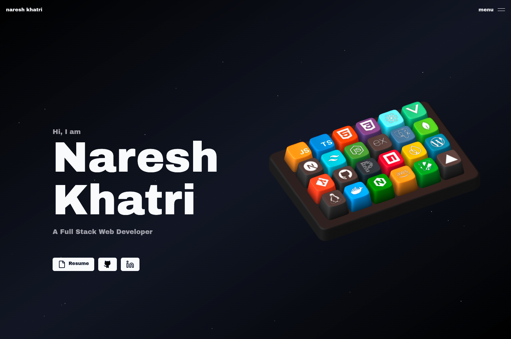

# Shemaiah Paramesvaran | Portfolio

Personal portfolio for Shemaiah Paramesvaran, a Computer Science undergraduate at Karunya Institute of Technology and Sciences focused on Artificial Intelligence, Machine Learning, IoT, and intelligent systems.

The portfolio explores curiosity, innovation, and execution through practical work across software, hardware, sustainability, and industrial safety.



## Features

- **Interactive 3D Keyboard** — Custom Spline keyboard where each keycap represents a skill, revealing titles and descriptions on hover/press
- **Buttery Animations** — GSAP + Framer Motion powered scroll, hover, and reveal animations
- **AI × IoT Direction** — Projects combining intelligent software with connected hardware
- **Light & Dark Mode** — Full theme support with cheeky disclaimer toasts
- **Responsive** — Works across all screen sizes
- **Contact Form** — Email delivery via Resend
- **Analytics** _(optional)_ — Umami analytics integration

## 🛠️ Tech Stack

| Layer | Technologies |
|---|---|
| **Framework** | Next.js 14, React 18, TypeScript |
| **Styling** | Tailwind CSS, Shadcn UI, Aceternity UI |
| **Animation** | GSAP, Framer Motion |
| **3D** | Spline Runtime |
| **Email** | Resend |
| **Misc** | Lenis (smooth scroll), Zod, next-themes |

---

## 🚀 Getting Started

### Prerequisites

- Node.js (v18+)
- pnpm (recommended), npm, or yarn

### Installation

1. **Clone the repository:**

    ```bash
    git clone https://github.com/Shemwild/portfolio.git
    cd portfolio
    ```

2. **Install dependencies:**

    ```bash
    pnpm install
    ```

3. **Set up environment variables:**

    Copy `.env.example` to `.env.local` and fill in the values:

    ```bash
    cp .env.example .env.local
    ```

    | Variable | Required | Description |
    |---|---|---|
    | `RESEND_API_KEY` | Yes | API key from [Resend](https://resend.com) for the contact form |
    | `NEXT_PUBLIC_WS_URL` | No | WebSocket server URL for realtime features (cursors, chat, presence) |
    | `UMAMI_DOMAIN` | No | Umami analytics script URL |
    | `UMAMI_SITE_ID` | No | Umami website ID |

4. **Run the development server:**

    ```bash
    pnpm dev
    ```

5. Open [http://localhost:3000](http://localhost:3000) and see the magic ✨

---

## Portfolio Content

Core identity and contact details are centralized in [`src/data/config.ts`](src/data/config.ts). Skills, leadership experience, and selected work live in [`src/data/constants.ts`](src/data/constants.ts) and [`src/data/projects.tsx`](src/data/projects.tsx).

Other files you'll want to customize:

| File | What to change |
|---|---|
| `src/data/projects.tsx` | Your projects, screenshots, descriptions, and tech stacks |
| `src/data/constants.ts` | Skills list (name, description, icon) and work experience |
| `public/assets/` | Your images, OG image, and project screenshots |

---

## ⌨️ Updating the 3D Keyboard Skills

The 3D keyboard keycaps are baked into a Spline file. To update the skills displayed on the keyboard:

1. **Import** the `public/assets/skills-keyboard.spline` file into [Spline](https://spline.design/)
2. **Unhide** the keycap objects you want to edit
3. **Update** the logo images on each keycap to your new skill icons
4. **Rename** each keycap object to match the skill's `name` field in `src/data/constants.ts` (e.g. `js`, `react`, `docker`)
5. **Hide** all keycap objects again
6. **Export** the scene and overwrite `public/assets/skills-keyboard.spline`

After updating the Spline file, make sure `src/data/constants.ts` has matching entries for every skill on the keyboard:

```ts
// Each keycap object name in Spline must match a key in SKILLS
export const SKILLS: Record<SkillNames, Skill> = {
  js: { name: "js", label: "JavaScript", shortDescription: "...", ... },
  react: { name: "react", label: "React", shortDescription: "...", ... },
  // ... add/remove entries to match your keyboard
};
```

The `SkillNames` enum, `SKILLS` record, and the Spline keycap names must all stay in sync for the keyboard interactions to work correctly.

---

## 🔌 Realtime Features (Optional)

The portfolio supports optional realtime features powered by a **separate backend API**:

- 🖱️ **Live cursors** — See other visitors' cursors in realtime
- 👥 **Online presence** — Shows who's currently on the site
- 💬 **Chat** — Live chat between visitors

These features activate automatically when the `NEXT_PUBLIC_WS_URL` environment variable is set. Without it, the portfolio works perfectly fine as a static site — no realtime features, no backend dependency.

> [!NOTE]
> The backend API is **not open source**. This is intentional! Too many people have cloned the portfolio and claimed they built it from scratch. The realtime server stays private to keep the live experience unique make make it standout.


---

## 🚀 Deployment

This site is deployed on **Vercel**. To deploy your own:

1. Push your code to a GitHub repository
2. Connect the repository to [Vercel](https://vercel.com)
3. Add your environment variables in the Vercel dashboard
4. Vercel handles the rest — automatic deployments on every push

---

## 🤝 Contributing

If you'd like to contribute or suggest improvements, feel free to open an issue or submit a pull request. All contributions are welcome!

---

## 📄 License

This project is open source and available under the [MIT License](LICENSE).

This portfolio is maintained as Shemaiah Paramesvaran&apos;s personal site.

Note on analytics: a deployed copy reports its own hostname once per browser (nothing else — no visitor, page, or referrer data) so I can see where the template gets used.
